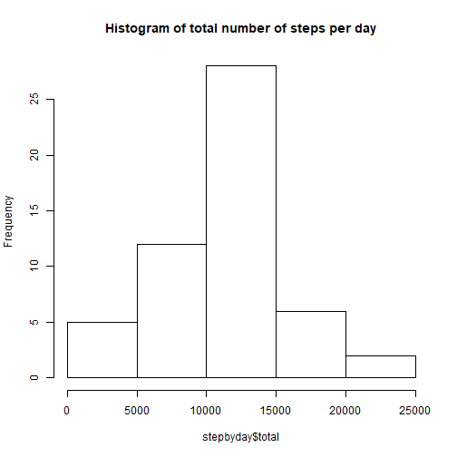
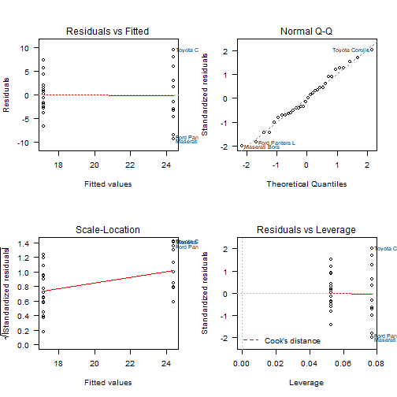
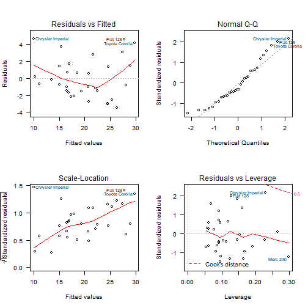
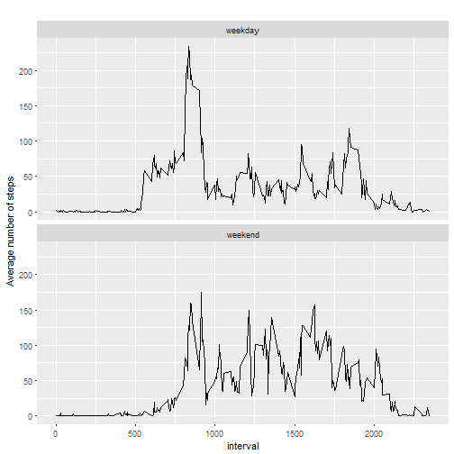

## load and process data

```r
data <- read.csv("activity.csv")
data <- data[ with (data, { !(is.na(steps)) } ), ]
```
## Histogram of the total numbers of steps taken per day

```r
library(dplyr)
data1 <- group_by(data, date)
stepbyday <- summarise(data1, total =sum(steps))
hist(stepbyday$total, main = "Histogram of total number of steps per day")
```


## Calculate mean and median steps taken by day

```r
summary(stepbyday)
```

```
##          date        total      
##  2012-10-02: 1   Min.   :   41  
##  2012-10-03: 1   1st Qu.: 8841  
##  2012-10-04: 1   Median :10765  
##  2012-10-05: 1   Mean   :10766  
##  2012-10-06: 1   3rd Qu.:13294  
##  2012-10-07: 1   Max.   :21194  
##  (Other)   :47
```
## Time series plot of the average number of steps taken

```r
stepbyinterval <- aggregate(steps ~ interval, data, mean)
plot(stepbyinterval$interval, stepbyinterval$steps, type = 'l', 
     xlab = 'Interval', ylab = 'average total steps', 
     main = "average numbers of steps over days")
```


## The 5-minute interval that, on average, contains the maximum number of steps

```r
row <- which.max(stepbyinterval$steps)
stepbyinterval[row, ]
```

```
##     interval    steps
## 104      835 206.1698
```
## Code to describe and show a strategy for imputing missing data

```r
sum(is.na(data))
```

```
## [1] 0
```

```r
newdata <- data
for (i in 1:nrow(newdata)) {
  if (is.na(newdata$steps[i])) {
    intervalX <- newdata$interval[i]
    stepsX <- stepbyinterval[stepbyinterval$interval == intervalX, ]
    newdata$step[i] < stepsX$steps
  }
}
```
## Histogram of the total number of steps taken each day after missing values are imputed

```r
stepbyday2 <- aggregate(steps ~ date, newdata, sum)
hist(stepbyday2$steps,  main = "total steps taken per day after missing values are imputed")
```



```r
mean(stepbyday2$steps)
```

```
## [1] 10766.19
```

```r
median(stepbyday2$steps)
```

```
## [1] 10765
```

```r
mean(stepbyday$total)
```

```
## [1] 10766.19
```

```r
median(stepbyday$total)
```

```
## [1] 10765
```
## Panel plot comparing the average number of steps taken per 5-minute interval across weekdays and weekends

```r
newdata$Day <- weekdays(as.Date(newdata$date))
newdata$Daytype <- "weekday"
newdata$Daytype[newdata$Day %in% c("Saturday", "Sunday")] <- "weekend"
                        
stepbyinterval_new <- aggregate(steps ~ interval + Daytype, newdata, mean)
library(ggplot2)
qplot(interval, steps, data = stepbyinterval_new,
      type = 'l', geom = c("line"), 
      xlab = 'interval', ylab = 'Average number of steps',
      main = "") + 
      facet_wrap(~ Daytype, ncol = 1)
```

```
## Warning: Ignoring unknown parameters: type
```




